# Awesome-Enterprise-Cloud-Support-Advisory

# Awesome-Enterprise-Cloud-Support-Advisory 🛟 🏢

  

  

  

  

  

  

  

---

## 🌟 Top Enterprise Cloud Support & Advisory Ecosystem

**Curated List of Commercial Cloud Support Programs & Open-Source Operations Toolkits**  

*Focused on 24/7 Enterprise Support, Technical Account Management, Proactive Advisory, Incident Response, Well-Architected Reviews & Self-Hosted Operations Tooling*

**Last updated: October 2026** 📅

---

### 📌 Overview & SEO Summary

Welcome to the ultimate curated directory of **enterprise cloud support and advisory platforms**, **open-source operations toolkits**, and **cloud governance frameworks**. Whether you are looking for enterprise-grade commercial support programs (such as *AWS Enterprise Support*, *Microsoft Unified*, and *Google Cloud Premium Support*), or self-hostable open-source alternatives (like *Prowler*, *Cloud Custodian*, and *Steampipe*), this list covers category leaders, proactive advisory, and privacy-respecting cloud operations.

**Key Market Context:**

- **AWS Enterprise Support** starts at **$15,000/month** or a percentage of AWS spend, with a **15-minute response time** for business-critical outages and a **dedicated Technical Account Manager (TAM)**.

- **Microsoft Unified Support** replaced Premier Support in 2020, charging **~$150–$300/user/year** for enterprise agreements, with **unified incident management and proactive advisory**.

- **Google Cloud Premium Support** costs **$18,000/month** or **4% of monthly GCP spend**, offering **15-minute P1 response** and **24/7 support in 12 languages**.

---

## 📑 Table of Contents

- [🏢 SaaS & Commercial Platforms](#-saas--commercial-platforms)

- [🔓 Open-Source GitHub Projects](#-open-source-github-projects)

- [🛠️ How to Contribute](#%EF%B8%8F-how-to-contribute)

- [📊 Star History](#-star-history)

- [🤝 Support & Sponsorship](#-support--sponsorship)

- [⚠️ Disclaimer](#%EF%B8%8F-disclaimer)

---

## 🏢 SaaS / Commercial Platforms

The enterprise cloud support market spans **hyperscaler support programs** (AWS Enterprise Support, Microsoft Unified, Google Cloud Premium) that provide **SLA-backed incident response, technical account management, and proactive advisory**, **managed service providers** (Rackspace, Cloudreach) that operate **cloud infrastructure on behalf of customers**, and **systems integrators and consultancies** (Accenture, Wipro, Cognizant, Slalom) that deliver **cloud transformation, migration, and optimization advisory**. **AWS Enterprise Support** starts at **$15,000/month** or a percentage of spend . **Microsoft Unified Support** is bundled into enterprise agreements at **~$150–$300/user/year** . **Google Cloud Premium Support** costs **$18,000/month** or **4% of GCP spend** .

| SaaS / Commercial Platform | Company / Owner | Valuation / Market Cap | Standard Edition Starting Price | Free Tier / Free Trial Limits | Description |

| :--- | :--- | :--- | :--- | :--- | :--- |

| **[AWS Enterprise Support](https://aws.amazon.com/premiumsupport/)** ☁️ | Amazon | ~$2.0 Trillion | **$15,000/month** or **% of AWS spend**  | **Free tier: Developer Support free with AWS account**  | **AWS-native enterprise support** — **15-minute response time** for business-critical outages . **Dedicated Technical Account Manager (TAM)** . **Infrastructure Event Management** and **Well-Architected Reviews** . **24/7 phone, chat, and email support** . **The most comprehensive cloud support program** . |

| **[Microsoft Unified Support](https://www.microsoft.com/en-us/unified)** 🔷 | Microsoft | ~$3.90 Trillion | **~$150–$300/user/year** (bundled into EA)  | **No free tier**; quote-based | **Microsoft-native unified support** — **Replaced Premier Support** in 2020 . **Unified incident management and proactive advisory** . **Designated Support Engineering (DSE)** for mission-critical workloads . **Reactive and proactive support** with **service-level commitments** . |

| **[Google Cloud Premium Support](https://cloud.google.com/support)** 🌐 | Google (Alphabet) | ~$2.0 Trillion | **$18,000/month** or **4% of GCP spend**  | **Free: Basic Support for all GCP customers**  | **GCP-native premium support** — **15-minute P1 response** . **24/7 support in 12 languages** . **Dedicated Technical Account Manager** . **Active Assist recommendations** and **proactive advisory** . **Standard Support from 3% of spend** . |

| **[IBM Cloud Services](https://www.ibm.com/cloud/services)** 🔵 | IBM | ~$200 Billion | **Custom enterprise pricing**  | **Free: Basic Support**  | **IBM-native cloud support** — **24/7 technical support** . **Dedicated Technical Account Manager** . **Advisory and managed services** for hybrid cloud . |

| **[Rackspace Technology](https://www.rackspace.com/)** 🏢 | Rackspace Technology | ~$500 Million | **Custom enterprise pricing**  | **Free: basic support**  | **Managed cloud services** — **Managed AWS, Azure, GCP, and private cloud** . **24/7 support with SLA-backed response** . **The most hands-on managed cloud provider** . |

| **[Cloudreach](https://www.cloudreach.com/)** ☁️ | Cloudreach (Atos) | ~$2 Billion (Atos) | **Custom enterprise pricing**  | **No free tier**; demo available | **Cloud advisory and managed services** — **Cloud migration, optimization, and operations** . **Deep AWS, Azure, and GCP partnerships** . |

| **[Slalom](https://www.slalom.com/)** 🎯 | Slalom | Private | **Custom enterprise pricing**  | **No free tier**; demo available | **Cloud transformation consultancy** — **Strategy, migration, and optimization** . **Industry-focused cloud advisory** . |

| **[Wipro Cloud Support](https://www.wipro.com/)** 🔴 | Wipro | ~$30 Billion | **Custom enterprise pricing**  | **No free tier**; demo available | **Global IT and cloud services** — **Cloud infrastructure management and support** . **24/7 global delivery model** . |

| **[Accenture Cloud First](https://www.accenture.com/)** 🟣 | Accenture | ~$200 Billion | **Custom enterprise pricing**  | **No free tier**; demo available | **Cloud-first transformation** — **The largest cloud consultancy globally** . **Migration, modernization, and managed services** . **Deep hyperscaler partnerships** . |

| **[Cognizant Cloud Support](https://www.cognizant.com/)** 🟢 | Cognizant | ~$40 Billion | **Custom enterprise pricing**  | **No free tier**; demo available | **Cloud infrastructure and operations** — **Managed cloud services** . **AI-driven operations (AIOps)** . **24/7 global support** . |

---

## 🔓 Open-Source GitHub Projects

*Sorted by GitHub_Stars_Count (Descending)* 🌟

- **[Cloud Custodian](https://github.com/cloud-custodian/cloud-custodian)**   

  **Rules engine for cloud security, cost optimization, and governance**, Apache-2.0 licensed. **5,877 GitHub stars** — **CNCF Incubating Project** with **10 years of production use** . **YAML-based policies for AWS, Azure, GCP, Oracle Cloud, Kubernetes, and Terraform** . **Automated remediation**: tag enforcement, idle resource cleanup, rightsizing, and compliance. **The most mature open-source cloud governance engine** — used by Capital One, Microsoft, and enterprises worldwide. 🛡️

- **[Prowler](https://github.com/prowler-cloud/prowler)**   

  **Comprehensive cloud security assessment tool**, Apache-2.0 licensed. **553 checks for AWS, 138 for Azure, 77 for GCP, 83 for Kubernetes** covering CIS, NIST 800, NIST CSF, PCI-DSS, GDPR, HIPAA, SOC2 . **Prowler App** provides visual interface with compliance framework mapping. **Direct mapping to compliance frameworks** — generate audit reports in hours . **The most widely used open-source cloud compliance scanner** . 🔍

- **[Steampipe](https://github.com/turbot/steampipe)**   

  **Query cloud APIs with SQL**, AGPL-3.0 licensed. **~7k+ stars** — **zero-ETL approach** — query AWS, Azure, GCP, Kubernetes, and 100+ services directly . **Build custom compliance queries with SQL** . **The simplest way to explore cloud configuration data** . 🔗

- **[OpenCost](https://github.com/opencost/opencost)**   

  **Open-source cost monitoring for Kubernetes**, Apache-2.0 licensed. **Originally developed and open-sourced by Kubecost** . **Real-time cost allocation** by cluster, node, namespace, controller, service, or pod . **Multi-cloud monitoring for AWS, Azure, GCP** . **MCP server built into Helm chart** for AI agent access. 🌱

- **[Komiser](https://github.com/tailwarden/komiser)**   

  **Cloud resource visibility and cost optimization**, Apache-2.0 licensed. **4,847 GitHub stars** — **multi-cloud dashboard for AWS, Azure, GCP, DigitalOcean, OCI, and Kubernetes** . **Detects idle resources, orphaned volumes, and untagged assets** . **The most popular open-source cloud resource inventory** . 🔍

- **[Infracost](https://github.com/infracost/infracost)**   

  **Cloud cost estimates for Terraform in pull requests**, Apache-2.0 licensed. **~10k+ stars** — **shift-left FinOps** — shows cost impact of infrastructure changes before deployment . **Supports AWS, Azure, GCP, and 1,000+ resources** . **The standard for preventing cost regressions in CI/CD** . 💰

- **[Checkov](https://github.com/bridgecrewio/checkov)**   

  **Static analysis for IaC**, Apache-2.0 licensed. **~7k+ stars** — scans **Terraform, CloudFormation, Kubernetes, and more** for security and compliance misconfigurations . **Plan-aware scanning** evaluates resolved values from `terraform plan` . **The standard for IaC security scanning** . 🔍

- **[AWS Well-Architected Tool (Open Source Alternatives)](https://github.com/topics/well-architected)**   

  **Open-source Well-Architected review frameworks**, open-source. **Community-driven checklists and review templates** for AWS Well-Architected Framework . **Automated assessment using Prowler and Cloud Custodian** . **The foundation for self-hosted architecture reviews** . 🏗️

- **[CloudQuery](https://github.com/cloudquery/cloudquery)**   

  **Cloud asset inventory and CSPM**, MPL-2.0 licensed. **~5k+ stars** — **extracts cloud configuration into PostgreSQL** for querying and analysis . **Enables custom governance queries** across multi-cloud environments . 📦

- **[Cartography](https://github.com/lyft/cartography)**   

  **Infrastructure asset and relationship mapping**, Apache-2.0 licensed. **3,020 GitHub stars** — **consolidates infrastructure assets and relationships in an intuitive graph view** powered by Neo4j . **Connects AWS, GCP, Azure, and SaaS sources** into a single queryable graph . **The foundational open-source infrastructure graph tool** . 🗺️

- **[ElectricEye](https://github.com/Cloud-Red-Team/ElectricEye)**   

  **Multi-cloud security posture management**, Apache-2.0 licensed. **962 GitHub stars** — **Python CLI tool for Asset Management, Security Posture Management & Attack Surface Monitoring** across AWS, Azure, GCP, and SaaS . **Continuous monitoring with automated remediation** . 🔭

---

## 🛠️ How to Contribute

Contributions are welcome! Follow these steps to submit new cloud support platforms or open-source operations toolkits:

1. 🍴 **Fork** the repository.

2. 📝 **Add/edit** entries in `README.md` maintaining table/list structure and formatting.

3. 🔗 Include project title, official website/GitHub link, exact Stars_Count, license, and brief description.

4. 🚀 Submit a **Pull Request** with a descriptive summary of your changes.

---

## 📊 Star History

---

## 🤝 Support & Sponsorship

If you find this enterprise cloud support repository useful, please consider supporting the project:

- ⭐ **Star** this repository to increase visibility!

- 🔀 **Fork** and share with fellow cloud architects, SREs, and open-source advocates.

- ☕ **Sponsor & Buy Me a Coffee**: Support ongoing open-source curation via the [GitHub Sponsor Dashboard](https://github.com/sponsors/ishandutta2007).

---

## ⚠️ Disclaimer

- This is a **community-curated** list — not exhaustive and not an endorsement. ℹ️

- **AWS Enterprise Support starts at $15,000/month** or a percentage of AWS spend — includes **15-minute response time** and **dedicated TAM** . **Google Cloud Premium Support costs $18,000/month** or **4% of GCP spend** . **Microsoft Unified Support is bundled into enterprise agreements** at **~$150–$300/user/year** .

- **Open-source operations toolkits (Prowler, Cloud Custodian, Steampipe) provide baseline capabilities** but **do not replace enterprise support SLAs** — they lack **24/7 incident response**, **dedicated TAMs**, and **vendor escalation paths** .

- **Open-source cloud operations tools are not turnkey** — they require **deployment, configuration, and ongoing maintenance** . **Cloud Custodian requires YAML policy authoring** . **Prowler requires multi-account setup** . **Always validate compliance findings against your specific requirements** before production deployment . 🛟

---

  <b>Made with ❤️ for cloud architects, SREs, and open-source cloud operations advocates.</b>

